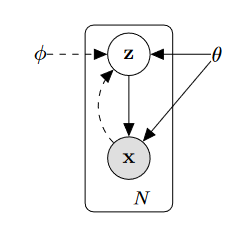

# Auto-Encoding Variational Bayes

## Main Contributions
1. A reparameterization of the variational lower bound yields a lower bound estimator that can be straightforwardly optimized using standard stochastic gradient method.
2. For i.i.d. datasets with continuous latent variables per datapoint, posterior inference can be made especially efficient by fitting an approximate inference model (also called a recognition model) to the intractable posterior using the proposed lower bound estimator.

## Problem scenario

-  X={{ x^{(i)} }}_{i=1}^N 

You may want to [config the site](https://tianqi.name/jekyll-TeXt-theme/docs/en/configuration) or [writing a post](https://tianqi.name/jekyll-TeXt-theme/docs/en/writing-posts) next. Please feel free to [create an issue](https://github.com/kitian616/jekyll-TeXt-theme/issues) or [send me email](mailto:kitian616@outlook.com) if you have any questions.

<!--more-->

---

If you like this post, don't forget to give me a star. :star2:

